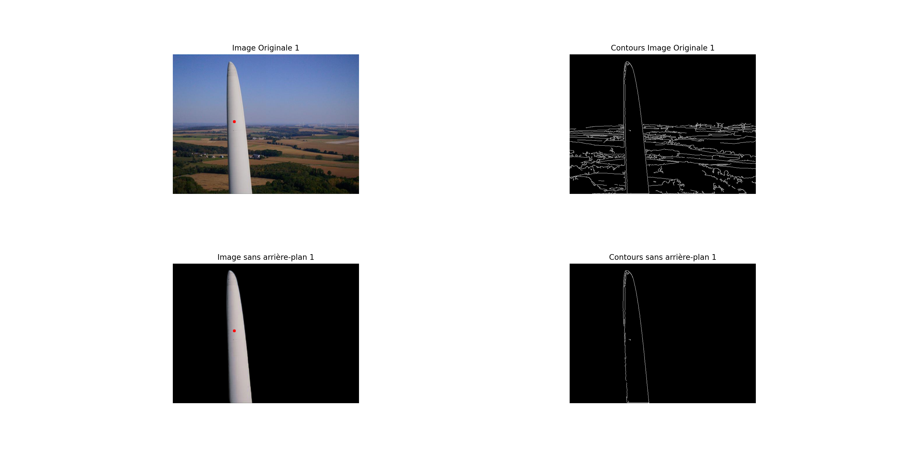

# Test_Technique_Ingenieur_Image

Cette répertoire contient l'implémentation des deux taches spécifiées dans le cahier des charges du test technique pour le poste ingénieur image chez SUPAIRVISION.

## Installation 
1) Cloner le répertoire :

```git clone``` 

2) Installer les dépendances : 

```pip install -r requirements.txt```

## Partie I - Traitement d’images classiques (en Python)

En Python, on crée une fonction qui prend en entrée l’image originale et donne en sortie l’image finale. L’image finale est l’image originale avec un point sur l’objet présent dans l’image. Le point doit-être le plus centré possible horizontalement et verticalement.

### Usage

Naviguer sur le dossier Python_Task: 

``` cd Python_Task ```

Pour lancer la fonction qui fait le dessin du point dans le centre de l'objet dans l'image originale : 

```python3 Center_Draw.py```

### Résultat 

A l'issu de ce programme python on obtient dans un fichier pdf l'ensemble des images originaux traitées pour obtenir la détection des contours avec Canny, l'image orignale sans background, le contour de l'image orignale sans background et le centre de l'objet dessiner sur l'image original.

Exemple: 



## Partie II - Détection d’objets (en C++)

### Usage 

Naviguer sur le dossier YOLO_Task: 

``` cd YOLO_Task ```

Compiler le code: 

```g++ yolo_detection.cpp -o yolo_detection `pkg-config --cflags --libs opencv4` ```

Pour faire la détection et suivi sur un vidéo: 

```./object_detection_yolo.out --video=MAH02363.MP4```

Pour faire la détection sur une image: 

```./object_detection_yolo.out --image=0007.jpg```

### Résultat 

Pour le vidéo MAH02363.MP4, On obtient: 


